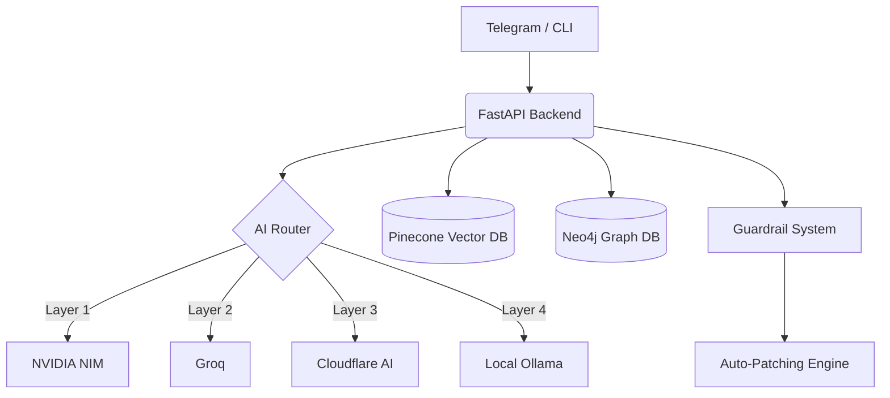

  
  
  # 🧬 EvoNet-Core: Autonomous AI Security Agent
  
  **Hệ Thống AI Tự Học và Tiến Hóa Bảo Mật Dựa Trên Luồng Thác Đổ Đa Tầng**

  
  
  
  
  

---

> **EvoNet-Core** là một hệ thống Trí tuệ Nhân tạo tiên tiến được thiết kế để tự động thu thập, phân tích và tiến hóa bảo mật dựa trên dữ liệu lỗ hổng CVE thực tế. Hệ thống đóng vai trò như một **Kỹ sư Bảo mật Tự trị**, có khả năng tự động rà quét mã nguồn, phát hiện lỗ hổng và sinh ra các bản vá code an toàn.

## ✨ Tính năng cốt lõi

### 🤖 Trí tuệ nhân tạo đa tầng (Fallback Routing)
- **Hệ thống AI đa lớp:** Sử dụng chiến lược failover (đỡ đạn) 4 lớp: `NVIDIA NIM -> Groq -> Cloudflare AI -> Local AI`. Đảm bảo hệ thống không bao giờ "sập" do giới hạn API.
- **Não bộ RAG & Knowledge Graph:** Tự động cập nhật kiến thức bảo mật từ dữ liệu CVE mới nhất vào Pinecone và xây dựng biểu đồ tri thức với Neo4j để chống "ảo giác" (hallucinations).

### 🛡️ Bảo mật chủ động & Guardrails
- **Mô phỏng tấn công (Red Team):** Chủ động mô phỏng các cuộc tấn công để kiểm thử sức chịu đựng của mã nguồn.
- **Màng lọc Tử thần (Regex Guardrail):** Chốt chặn sinh tử cấm AI thực thi các lệnh phá hoại như `os.remove`, `DROP TABLE`, `rm -rf`. Kích hoạt báo động đỏ và đóng băng tiến trình ngay lập tức.
- **Human-in-the-Loop:** Tự động tạo bản nháp code sửa lỗi và chờ người dùng duyệt (`/duyet_tienhoa`) qua Telegram trước khi áp dụng vào thực tế.

### 🔌 Tích hợp CI/CD & Giao diện CLI
- **Giao diện dòng lệnh (CLI):** Tích hợp Typer & Rich cho trải nghiệm Terminal chuyên nghiệp.
- **Điều khiển qua Telegram:** Bot giám sát 24/7, báo cáo sự cố và nhận lệnh từ xa.

---

## 🏗️ Kiến trúc Hệ thống

Hệ thống được thiết kế theo mô hình Micro-services bọc trong container, tối ưu hóa cho các hệ thống máy chủ nhỏ (như Intel NUC).

🚀 Hướng dẫn Cài đặt & Chạy
1. Triển khai với Docker (Khuyên dùng)
Yêu cầu hệ thống: Docker, Docker Compose, Linux/Ubuntu.

# Clone dự án
git clone [https://github.com/phonghhd/EvoNet-AI-Core.git](https://github.com/phonghhd/EvoNet-AI-Core.git)
cd EvoNet-AI-Core

# Cấu hình API Keys
cp .env.example .env
nano .env 

# Khởi động toàn bộ cụm dịch vụ
docker-compose up -d

2. Sử dụng Giao diện Dòng lệnh (EvoNet CLI)
EvoNet cung cấp bộ công cụ CLI mạnh mẽ giúp quản lý trực tiếp từ Terminal:

# Cài đặt CLI vào hệ thống
pip install -e .

# Xem danh sách các lệnh hỗ trợ
evonet --help

# Quét và tự động vá lỗi một thư mục dự án
evonet scan --path /path/to/your/code

📱 Lệnh Điều khiển Telegram
Chỉ chấp nhận các lệnh từ ADMIN_CHAT_ID đã cấu hình:

🛠️ /update - Khởi động chu trình thu thập và tiến hóa đầy đủ.

📡 /gat_cve - Chỉ thu thập và nhúng dữ liệu CVE mới vào Pinecone.

🕵️ /test_autofix - Kích hoạt Đặc vụ AI rà quét và đề xuất code vá lỗi.

✅ /duyet_tienhoa - Chấp nhận và ghi đè bản vá lỗi vào source code.

❌ /tu_choi - Hủy bỏ bản nháp do AI đề xuất.