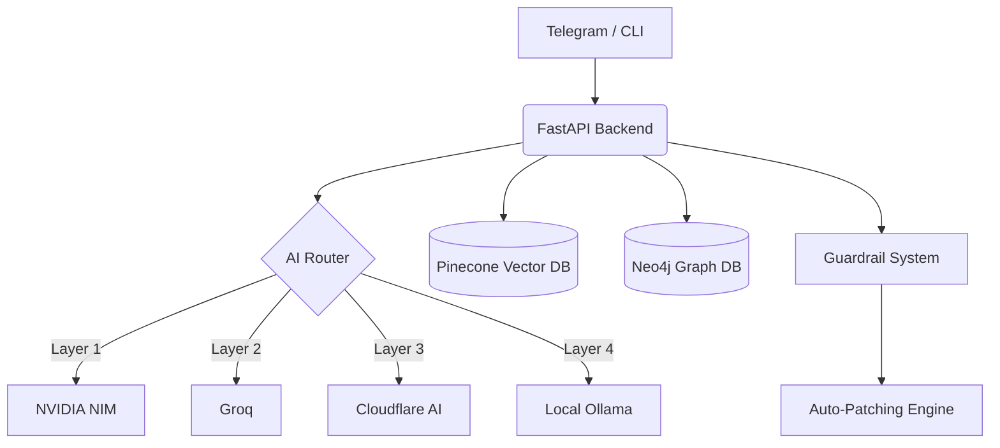

  
  
  # 🧬 EvoNet-Core: Autonomous AI Security Agent
  
  **Self-Learning & Evolutionary Security System Powered by Multi-Tier LLM Routing**

  
  
  
  
  
  

---

> **EvoNet-Core** is an advanced Artificial Intelligence system designed to autonomously harvest, analyze, and evolve defenses based on real-world CVE (Common Vulnerabilities and Exposures) data. Acting as an **Autonomous Security Engineer**, it proactively scans source code, detects vulnerabilities, and generates secure, production-ready patch code.

## 📑 Table of Contents
- [Core Features](#-core-features)
- [System Architecture](#-system-architecture)
- [Getting Started](#-getting-started)
- [Usage (CLI & Telegram)](#-usage)
- [Disclaimer](#-disclaimer)

---

## ✨ Core Features

### 🤖 Multi-Tier AI Routing (Fallback Engine)
- **High-Availability AI Layer:** Implements a robust 4-tier failover strategy: `NVIDIA NIM -> Groq -> Cloudflare AI -> Local AI`. Ensures zero downtime even during API rate limits.
- **RAG & Knowledge Graph Engine:** Continuously ingests the latest CVE intelligence into **Pinecone** (Vector DB) and structures complex threat relationships using **Neo4j** (Graph DB) to strictly eliminate LLM hallucinations.

### 🛡️ Proactive Defense & Guardrails
- **Automated Red Teaming:** Proactively simulates attack vectors to stress-test target source code.
- **Lethal Filter (Regex Guardrails):** Strict pre-execution validation blocks destructive AI-generated commands (e.g., `os.remove`, `DROP TABLE`, `rm -rf`), instantly triggering a system freeze and red alert.
- **Human-in-the-Loop (HITL):** Generates draft patch code and awaits manual authorization via Telegram (`/duyet_tienhoa`) before applying modifications to the codebase.

### 🔌 Seamless CI/CD & Interactivity
- **CLI Tooling:** Integrated with `Typer` & `Rich` for a highly visual, professional Terminal experience.
- **Telegram Bot Integration:** 24/7 monitoring, real-time incident reporting, and remote command execution via an encrypted Telegram channel.

---

## 🏗️ System Architecture

The ecosystem is built on a containerized microservices architecture, heavily optimized for edge computing and Mini PC deployments (e.g., Intel NUC).

🚀 Getting Started
Prerequisites
Docker & Docker Compose

Python 3.11+ (for local development)

Valid API keys (Pinecone, LLM Providers, Telegram Bot)

1. Docker Deployment (Recommended)

# Clone the repository
git clone [https://github.com/phonghhd/EvoNet-AI-Core.git](https://github.com/phonghhd/EvoNet-AI-Core.git)
cd EvoNet-AI-Core

# Configure Environment Variables
cp .env.example .env
nano .env 

# Spin up the microservices cluster
docker-compose up -d

2. Local CLI Installation
EvoNet provides a powerful CLI suite for direct Terminal management:

# Install the CLI package globally
pip install -e .

# View available commands
evonet --help

# Scan and auto-patch a specific project directory
evonet scan --path /path/to/your/code

📱 Usage
Telegram Remote Control
Note: Commands are strictly authorized only for configured ADMIN_CHAT_ID.

Command and Action
🛠️ /update - Triggers a full cycle: CVE Harvesting + Analysis + Evolution.
📡 /gat_cve - Harvests only new CVEs and embeds them into Pinecone.
🕵️ /test_autofix - Activates AI Agent to scan code and propose patches.
✅ /duyet_tienhoa - Approves and overwrites target source code with the patch.
❌ /tu_choi - Rejects and discards the AI-proposed draft patch.

⚠️ Disclaimer
EvoNet-Core is developed strictly for educational, research, and defensive purposes. The auto-patching mechanism modifies source code automatically. Always use version control (e.g., Git) and review AI-generated patches before deploying to production environments. The author is not responsible for any damage caused by misuse of this software.
